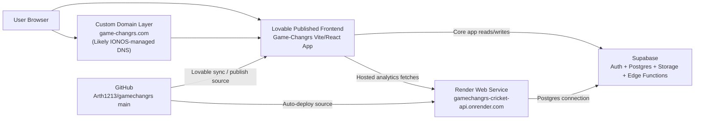

# Game-Changrs Deployed Stack Backup And Architecture

Date: 2026-04-27  
Owner: game-changrs.com / Arth Arun

## 1. Snapshot Summary

This document captures the current Game-Changrs + Bay Area U15 cricket analytics deployment state after:

- Bay Area U15 analytics integration was merged to GitHub `main`
- the Render cricket API was deployed successfully
- cross-origin access was enabled for the hosted frontend
- the Lovable frontend was updated to use the Render cricket API outside localhost

Confirmed live references at the time of this snapshot:

- GitHub repo: `Arth1213/gamechangrs`
- GitHub default branch: `main`
- Frontend integration commit on `main`: `d549fb8` (`Use Render cricket API outside localhost`)
- Render API compatibility commit on `main`: `3f30a26` (`Allow cross-origin access to cricket API`)
- Render service name: `gamechangrs-cricket-api`
- Render API URL: `https://gamechangrs-cricket-api.onrender.com`
- Active cricket series config key: `bay-area-usac-hub-2026`
- Active cricket series name: `2026 Bay Area USAC Hub`
- Current series age group: `U15`
- Computed matches: `42`
- Player count in active series: `167`
- Warning matches: `7`

## 2. Backup State Created

This snapshot is backed up in three ways:

1. Repo-side documentation backup:
   - this file
2. GitHub backup reference:
   - backup branch: `backup/2026-04-27-deployed-stack`
   - backup tag: `backup-2026-04-27-deployed-stack`
3. Local Git bundle backup:
   - `/Users/artharun/Downloads/GAME-CHANGRS/backups/gamechangrs-deployed-stack-2026-04-27.bundle`

Important:

- This backup covers the codebase state and deployment architecture state.
- It does **not** include secret values.
- It does **not** include a full exported copy of the Supabase database or storage buckets.

## 3. Component Inventory

### GitHub

Purpose:

- source of truth for code
- deployment trigger source for Render
- sync source for Lovable/Git-backed frontend changes
- backup anchor via branch/tag history

Current usage:

- repo: `Arth1213/gamechangrs`
- default branch: `main`

### Lovable

Purpose:

- visual/editor workflow for the main Game-Changrs frontend
- preview environment
- publish surface for the frontend application

Current usage:

- hosts and publishes the Vite/React frontend
- pulls from GitHub `main`
- preview confirmed to show the updated `/analytics` experience

### Render

Purpose:

- Node/Express hosting for the Bay Area U15 cricket analytics API

Current usage:

- service: `gamechangrs-cricket-api`
- repo branch: `main`
- root directory: `bay-area-u15`
- build command: `npm install`
- start command: `npm run api:start`
- live URL: `https://gamechangrs-cricket-api.onrender.com`

### Supabase

Purpose:

- primary application backend for Game-Changrs
- auth
- relational data
- storage
- edge functions for non-Render app features
- source-of-truth Postgres backing the cricket analytics API

Current usage:

- root frontend uses Supabase client env vars:
  - `VITE_SUPABASE_URL`
  - `VITE_SUPABASE_PUBLISHABLE_KEY`
- cricket Render API uses Postgres connection env vars:
  - `DATABASE_URL`
  - `DATABASE_SSL_MODE`
  - `PORT`
  - optional `CORS_ALLOW_ORIGIN`

Known Supabase function paths currently present in the repo:

- `supabase/functions/analyze-cricket`
- `supabase/functions/analyze-gear-image`
- `supabase/functions/contact-form`
- `supabase/functions/contact-seller`
- `supabase/functions/cricclubs-player-analytics`
- `supabase/functions/generate-career-summary`
- `supabase/functions/scrape-profile-url`
- `supabase/functions/send-connection-email`
- `supabase/functions/send-session-notification`

### IONOS / Domain Layer

Purpose:

- likely registrar and/or DNS provider for `game-changrs.com`
- possible email/domain management layer

Status:

- `game-changrs.com` is referenced in repo copy and branding
- IONOS/DNS configuration was **not** directly exported or verified from the repo itself
- treat IONOS as an external dependency that must be documented manually if disaster recovery needs to include DNS re-pointing

## 4. Current Runtime Architecture

## 5. Analytics-Specific Runtime Path

### Localhost behavior

When running locally:

- frontend default analytics base: `/cricket-api`
- Vite dev proxy forwards `/cricket-api/*` to the local Express API

### Hosted behavior

When running outside localhost:

- frontend default analytics base resolves to:
  - `https://gamechangrs-cricket-api.onrender.com`
- hosted analytics requests go directly from the published frontend to Render
- CORS is enabled by the Render API code path

### Key live routes

Render API:

- `/health`
- `/api/dashboard/summary`
- `/api/players/search`
- `/api/players/:playerId/report`
- `/players/:playerId`
- `/series/:seriesConfigKey/players/:playerId/report`

Frontend:

- `/analytics`
- `/analytics/workspace`
- `/analytics/reports/:playerId`

## 6. What Each Layer Is Used For

### Main frontend app

Used for:

- landing pages
- coaching marketplace
- gear marketplace
- user-facing Game-Changrs product flows
- in-app cricket analytics search/report shell

### Render cricket API

Used for:

- live Bay Area U15 selector analytics
- series summary
- player search
- player report JSON
- standalone report HTML rendering

### Supabase core app stack

Used for:

- auth/session handling
- core marketplace / coaching / user data
- storage-backed assets
- non-Render edge functions

### Supabase as analytics data source

Used for:

- source-of-truth cricket analytics tables consumed by the Render API
- current confirmed active series summary:
  - series: `2026 Bay Area USAC Hub`
  - player count: `167`
  - tracked matches: `42`
  - computed matches: `42`
  - warning matches: `7`

## 7. Secrets And Non-Repo Configuration

These items are required in deployment but are **not** stored in Git backup:

### Lovable / frontend env

- `VITE_SUPABASE_URL`
- `VITE_SUPABASE_PUBLISHABLE_KEY`
- optional `VITE_CRICKET_API_BASE` override if ever needed

### Render env

- `DATABASE_URL`
- `DATABASE_SSL_MODE`
- `PORT`
- optional `CORS_ALLOW_ORIGIN`

### Supabase secrets

- project URL
- anon/publishable key
- service role key
- database password / pooler URI

### IONOS / domain secrets

- registrar login
- DNS zone control
- any MX/TXT/CNAME/A records used for domain/email

## 8. What Is Backed Up vs Not Backed Up

### Backed up now

- GitHub `main` code state
- cricket analytics integration code
- Render API code
- frontend hosted API fallback code
- deployment/architecture documentation
- Git backup branch/tag
- local Git bundle backup

### Not backed up now

- Supabase Postgres full data export
- Supabase storage bucket export
- Render environment secret export
- Lovable project secret/config export
- IONOS DNS zone export

## 9. Disaster Recovery Sequence

If this stack needs to be rebuilt:

1. Restore the repo from GitHub `main`, backup branch, tag, or local Git bundle.
2. Recreate the Render web service:
   - service name: `gamechangrs-cricket-api`
   - branch: `main`
   - root directory: `bay-area-u15`
   - build: `npm install`
   - start: `npm run api:start`
3. Restore Render env vars:
   - `DATABASE_URL`
   - `DATABASE_SSL_MODE=require`
   - `PORT=10000`
   - optional `CORS_ALLOW_ORIGIN=*`
4. Reconnect Lovable to GitHub `main`.
5. Publish the frontend from Lovable.
6. Restore any custom domain / DNS mapping in IONOS if needed.
7. Restore Supabase database/storage from platform-native exports if disaster recovery requires data continuity.

## 10. Operational Notes

- Render free tier may spin down on inactivity and delay first response.
- Render currently only needs the API-layer commits that touch `bay-area-u15`.
- The frontend hosted API fallback commit exists on `main` so Lovable can call Render without special local proxy behavior.
- The older Supabase edge function `supabase/functions/cricclubs-player-analytics` remains in the repo but is not the authoritative runtime for the Bay Area U15 analytics flow now using Render.

## 11. Recommended Next Backups

To make this a fuller disaster recovery package, the next manual backups should be:

1. Supabase Postgres export (`pg_dump` or Supabase backup/export path)
2. Supabase storage bucket export
3. Render service settings screenshot/export
4. Lovable project settings + publish target screenshot/export
5. IONOS DNS zone export / screenshots
